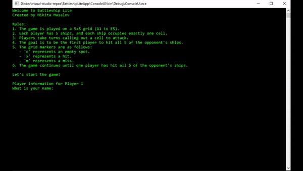

# About

This is my first project written in C# during my learning of this language.

# Battleship Lite

Welcome to Battleship Lite, a simplified version of the classic Battleship game. In this game, two players compete to sink each other's fleet of ships on a 5x5 grid.

## How to Play

* The game board consists of a 5x5 grid, with cells labeled from A1 to E5.

* Each player has 5 ships, and each ship occupies exactly one cell on the grid.

* Players take turns calling out grid coordinates to attack.

* The objective is to be the first player to hit all 5 of the opponent's ships.

* Grid markers indicate the result of each attack:
	* o represents an empty spot.
	* x represents a hit.	
	* m represents a miss.
											
* The game continues until one player successfully hits all 5 of the opponent's ships.
* Enjoy this quick and strategic game of Battleship Lite!

	

